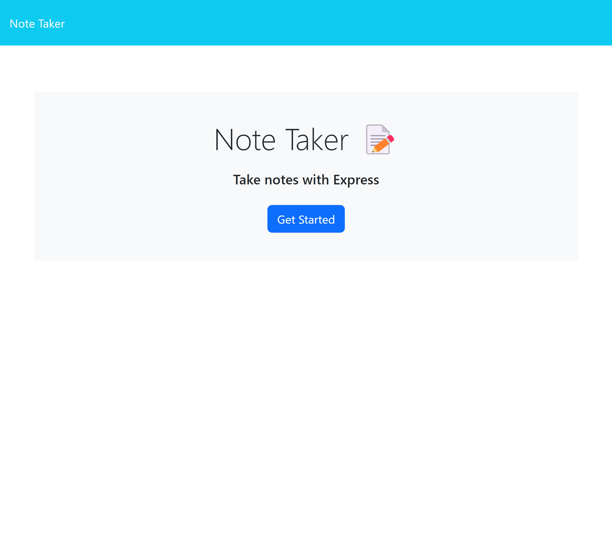
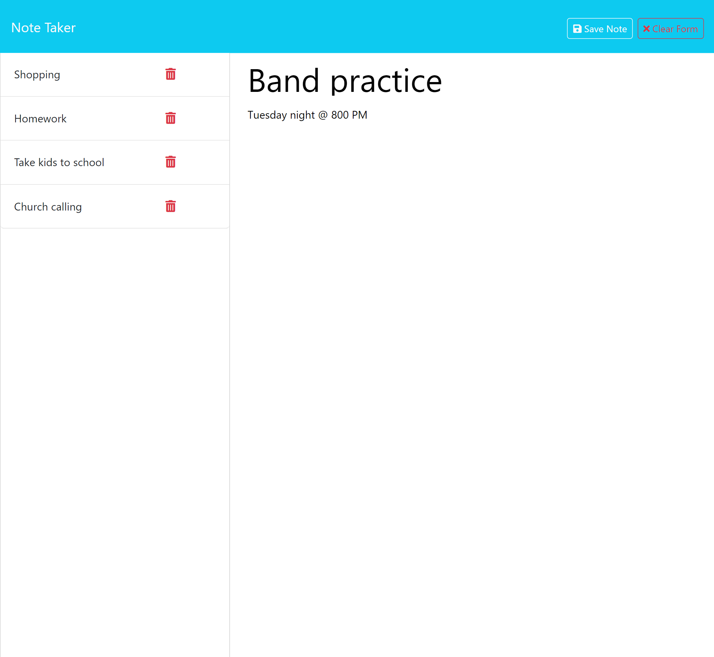

# orullian-note-taker-module-11-challenge

https://orullian-note-taker-module-11-challenge.onrender.com/notes

## Description
This is a note taker that uses express and the file system to store the notes as json on the back-end.  The front-end shows a simple interface with two pages.  The first is an introductory page with a button to direct the user to the actual note taking page. Users will initially see a relatively blank screen with 'Note Title' and 'Note Text' on the right side of the screen.  As users input their notes, they will show on the left side of the screen as a list.  The user can click on these to show all details that were originally written.

This project showed me how simple databases from .json files can be created.  While this simple project didn't need it, it is obvious that making your routes modular can make organization much simpler.  If you are working on a project with hundreds of routes, each with their own CRUD functionality, this can quickly disorganize a server.js file.  It is much better to keep each route separate and link them all to a single index.js router and feed that into your root server.js.

Additionally, this project was deployed via Render, which has a great free version that allows users to easily deploy their projects from a github repo.  

## Usage
Users should open the website included at the top of the README in their browser of choice.  The user will initially be directed to the homepage.  It should be noted that all parameters added after the url will direct the user back to the homepage unless it is specifically '/notes'.  Clicking on the 'Get Started' button will direct the user to the note taker itself.  Users must input a note title and note text into the note taker.  While making inputs, a 'Clear Form' button will show in the top right of the screen; and, when pressed, will clear all current note text.  After filling out the current note, the user must press 'Save Note' in the top right of the screen.  This will add the note to the database and it will also add it to the list on the left-hand side of the screen.  The user can click on a note from the left-hand side and it's information will show on the right, including the text.  By pressing the trashcan icon next to a particular note item, that item will be removed from the database and from the list on the lef-hand side.  

## Credits
### Third-Party Assets
- node.js
- npm
    - express.js
    - uuidv4
- Render

Starter code has been provided by Southern Methodist University Coding Bootcamp and included the majority of the front-end.

The repo for the original code can be found here: [Original Code Repo](https://git.bootcampcontent.com/Southern-Methodist-University/SMU-VIRT-FSF-PT-05-2024-U-LOLC/-/tree/main/11-Express/02-Challenge?ref_type=heads)

This project is part of an ongoing coding bootcamp